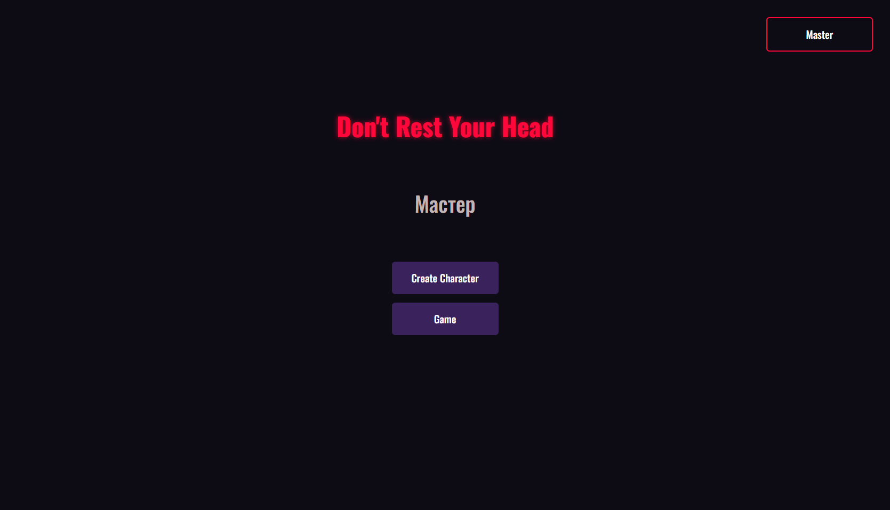
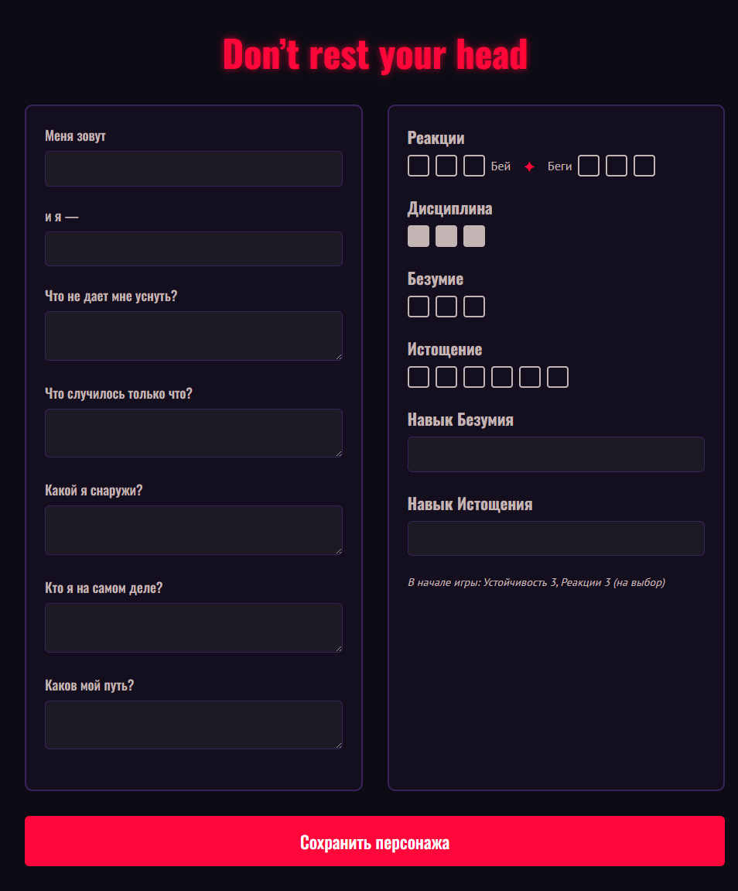
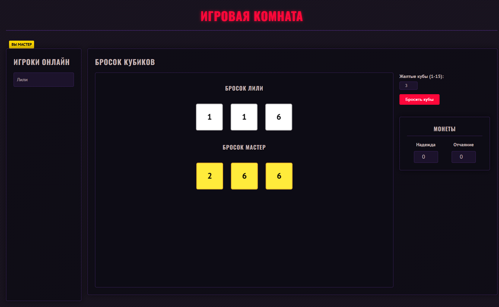
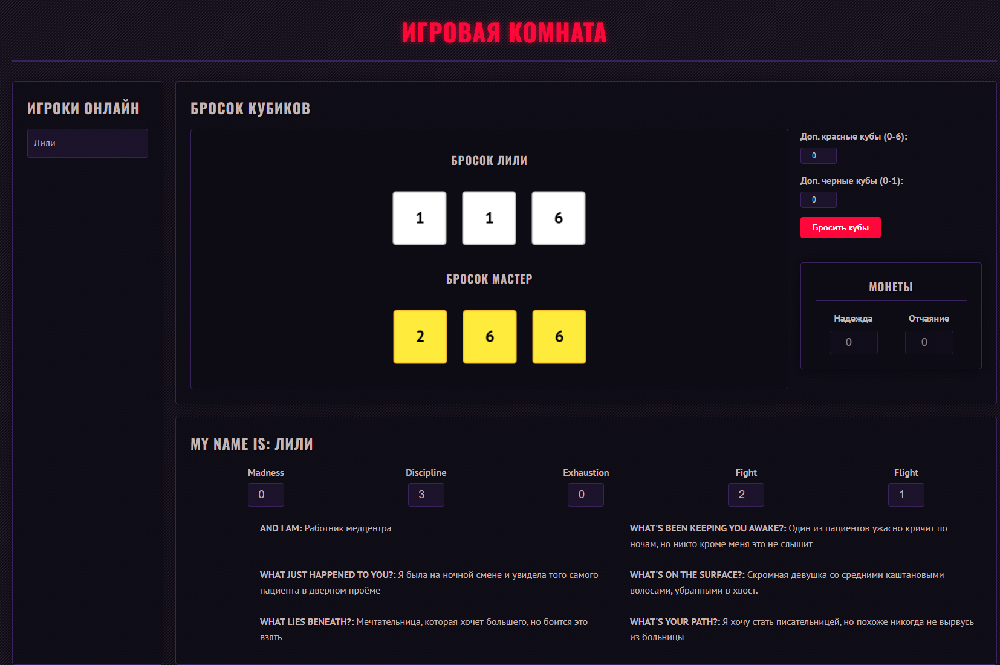
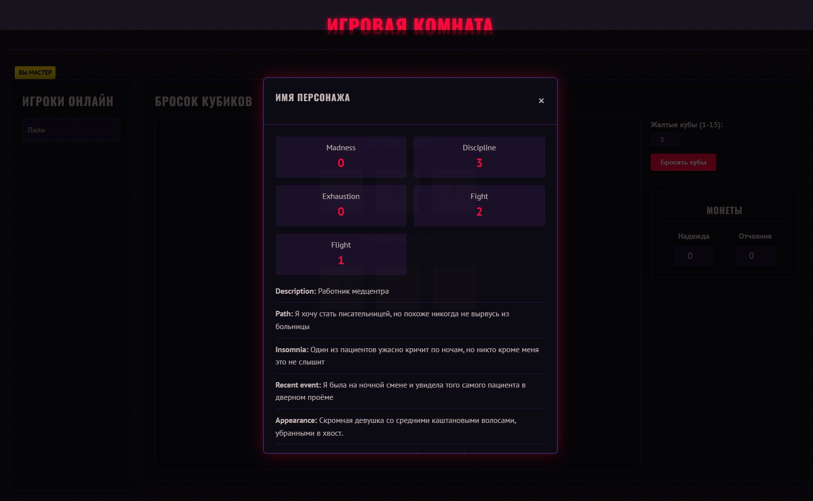

Конечно! Вот обновленная версия README.md для вашего проекта:

# Don't Rest Your Head - Онлайн система для настольной игры

Веб-приложение для игры в настольную ролевую игру "Don't Rest Your Head" с возможностью создания персонажей, броска кубиков и взаимодействия между игроками в реальном времени.

## 🎯 Особенности

- **Полноценный игровой интерфейс** с созданием персонажей и реальным временем
- **Визуализация бросков кубиков** с 3D-анимацией
- **Управление монетами** Надежды и Отчаяния
- **Просмотр статистики** других игроков
- **Адаптивный дизайн** для различных устройств

## 🛠 Технологический стек

- **Backend**: Python + Flask + Flask-SocketIO
- **Frontend**: HTML5, CSS3, Vanilla JavaScript
- **Real-time communication**: Socket.IO
- **Стилизация**: Custom CSS с CSS Grid и Flexbox
- **Шрифты**: Google Fonts (Oswald, PT Sans)

## 🎮 Функциональность

### Создание персонажа
- Интуитивная форма заполнения характеристик


### Игровой процесс
- **Для Мастера**:
  - Бросок кубов Боли (🟨 желтые, 1-15 кубов)
  - Управление монетами Надежды и Отчаяния
  - Просмотр всех персонажей

- **Для Игроков**:
  - Бросок кубов Дисциплины (⬜ белые), Безумия (🟥 красные) и Истощения (⬛ черные)
  - Дополнительные кубы: Безумия (0-6) и Истощения (0-1)
  - Обновление характеристик в реальном времени
  - Просмотр других игроков

### Интерфейс
- Адаптивный дизайн для desktop и mobile
- 3D-анимация бросков кубиков
- Модальные окна для просмотра персонажей
- Визуальная обратная связь при взаимодействии

## 🚀 Быстрый старт

1. Установите зависимости:
```bash
pip install -r requirements.txt
```

2. Запустите приложение:
```bash
python app.py
```

3. Откройте в браузере: `http://localhost:5100`

4. Создайте персонажа через "Create Character"
5. Перейдите в "Game" для начала игры

## 📁 Структура проекта

```
dryh_game_site/
├── app.py                 # Основное Flask-приложение
├── templates/             # HTML шаблоны
│   ├── index.html         # Главная страница
│   ├── character_sheet.html # Форма создания персонажа
│   └── game.html          # Игровой интерфейс
├── static/
│   ├── css/              # Стили
│   │   ├── index.css      # Стили главной страницы
│   │   ├── character_sheet.css # Стили листа персонажа
│   │   └── game.css       # Стили игрового интерфейса
│   └── js/               # JavaScript
│       ├── character_sheet.js # Логика листа персонажа
│       └── game.js        # Игровая логика
└── README.md             # Документация
```

## 🔧 API и события Socket.IO

### Основные события:
- `roll_dice` - бросок кубиков
- `update_character` - обновление характеристик
- `update_coins` - обновление монет
- `request_coins` - запрос текущих монет
- `update_players` - обновление списка игроков
- `dice_rolled` - результат броска кубиков

## 📋 Дорожная карта развития

### 🔜 Ближайшие планы
- [ ] Система правил игры с быстрым доступом
- [ ] Автоматический подсчет успехов при бросках
- [ ] История бросков с фильтрацией

### 🎯 Будущие возможности
- [ ] Экспорт истории игры
- [ ] Интерактивный гайд по созданию персонажа
- [ ] Система чата между игроками
- [ ] Интеграция с популярными VTT платформами

## 🖼 Скриншоты

### Главная страница


### Создание персонажа


### Игровой интерфейс (Мастер)


### Игровой интерфейс (Игрок)


### Просмотр персонажа



## 📄 Лицензия

Этот проект является фанатским и не предназначен для коммерческого использования. Don't Rest Your Head создана Фредом Хиксом и издана Evil Hat Productions.

---

*Присоединяйтесь к бессоннице! Создавайте персонажей, бросайте кубы и погрузитесь в кошмарный мир Don't Rest Your Head!*


---

*Don't Rest Your Head создана Фредом Хиксом и издана Evil Hat Productions. Данное приложение является фанатским проектом и не предназначено для коммерческого использования.*